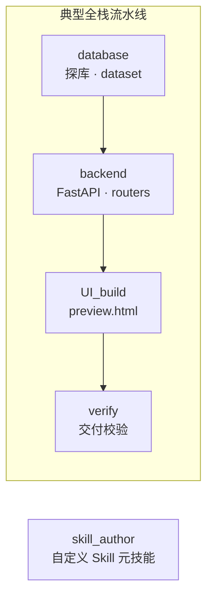
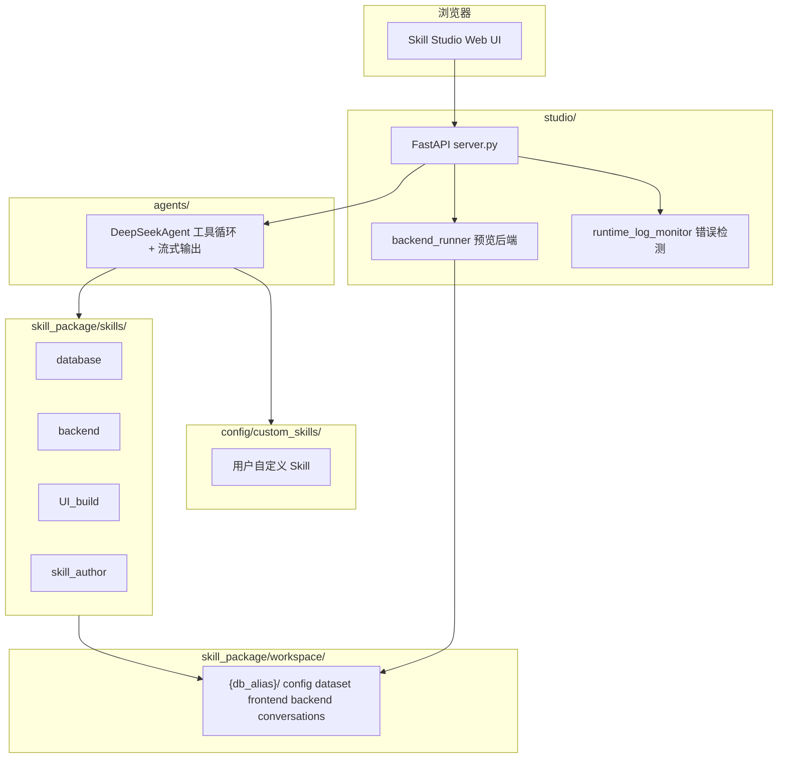

# Skill Studio

基于 **DeepSeek** 与 **Agent Skill（智能体技能）** 的本地 SaaS 构建工作台：你只需用自然语言对话，**系统 Skill** 会驱动智能体连接数据库、写后端 API、写前端页面，并在同一工作区内完成全栈预览。

> **Skill Studio 的核心不是「聊天」，而是一套可编排、可落盘、可预览的「系统 Skill」体系**——每个 Skill = `SKILL.md` 规范 + Python 工具 + 写入 `workspace/{db_alias}/` 的产物。

**界面语言**：Web UI 默认 **English**，右上角 **EN | 中文** 可切换。

---

## 核心：系统 Skill 是什么？

**系统 Skill** 位于 `skill_package/skills/`，是平台内置、带**真实执行能力**的智能体模块：

| 组成 | 作用 |
|------|------|
| **`SKILL.md`** | 告诉模型「做什么、按什么顺序、禁止什么」；含 YAML frontmatter（`name`、`description`、`version` 等） |
| **Python 工具** | 通过 `@register_skill_tool` 注册；对话时以 function calling 形式交给 DeepSeek 调用 |
| **工作区落盘** | 工具执行结果写入 `skill_package/workspace/{db_alias}/`（config、dataset、backend、frontend…） |

对话时，Studio 会：

1. 加载所选 Skill 的 `SKILL.md` 正文，拼入 system prompt；
2. 合并这些 Skill 注册的工具 schema，交给 `DeepSeekAgent` 多轮调用；
3. 工具在本地读写文件、连库、校验契约——**不靠模型「假装写代码」**。

在 **Skill library / Skill 库 → System / 系统** 可浏览每个系统 Skill 的 `SKILL.md`、工具列表与目录结构（**只读**，不可在线改代码；扩展请 fork 或新增目录）。

### 内置四个系统 Skill



| Skill | 目录 | 做什么 | 主要落盘路径 | 代表工具 |
|-------|------|--------|--------------|----------|
| **database** | `skills/database/` | 只读探查源库 / 源文件，整理业务知识 | `dataset/*.md` | `database_connect`、`list_tables`、`describe_table`、`execute_query`、`save_markdown` |
| **backend** | `skills/backend/` | 生成可运行的 FastAPI 后端 | `backend/{project}/` | `scaffold_fullstack_project`、`save_backend_file`、`patch_backend_file`、`get_fullstack_api_contract`、`verify_fullstack_deliverables` |
| **UI_build** | `skills/UI_build/` | 生成接库前端与 UI 知识 | `frontend/{project}/` | `save_ui_file`、`patch_ui_file`、`read_database_config`、`get_fullstack_api_contract` |
| **skill_author** | `skills/skill_author/` | 对话式创建**自定义 Skill**（无 Python 工具链） | `config/custom_skills/` | `create_custom_skill`、`write_custom_skill_file` |

四个 Skill **共用同一工作区** `workspace/{db_alias}/` 下的 `config.json`、`manifest.json`，因此 database 写的领域文档、backend 写的 API、UI_build 写的前端可以无缝衔接。

### 全栈生成：系统 Skill 如何协作？

新建一套「能跑起来」的前后端，推荐顺序（已写入 `backend` / `UI_build` 的 `SKILL.md` 与 `skill_package/core/fullstack_orchestration.py`）：

| 步骤 | Skill | 动作 |
|------|-------|------|
| 1 | database | 连源库 / 读源文件 → 写 `dataset/` 领域文档；必要时在目标库建表 |
| 2 | backend | `get_fullstack_generation_spec` → **`scaffold_fullstack_project`** 一键骨架 |
| 3 | backend | `save_backend_file` 补充 routers；**禁止**相对导入、双轨路由 |
| 4 | backend + UI_build | `get_fullstack_api_contract` → 按 `route_fetch_map` 对齐路径 |
| 5 | UI_build | `save_ui_file` 写 `preview.html`（`FULLSTACK_API` + `apiGet` / `apiPost`） |
| 6 | backend | **`verify_fullstack_deliverables`** → `system_complete: true` 才能对用户说「系统完成」 |

**写盘门禁**：`save_backend_file` / `save_ui_file` 违反全栈契约会返回 `blocked: true`，从机制上避免生成「看起来写完、预览却 404」的代码。

**数据库密码**：智能体通过 `database_connect(use_workspace_config=true)` 读磁盘 `config.json`，**不会**在对话里向用户索要密码（`read_database_config` 里的 `***` 仅为脱敏展示）。

### 系统 Skill vs 自定义 Skill

| | **系统 Skill** | **自定义 Skill** |
|--|----------------|------------------|
| 路径 | `skill_package/skills/{name}/` | `config/custom_skills/{skill_id}/` |
| 工具 | 有 Python 工具（连库、写文件、校验） | 通常只有 `SKILL.md` 指令 |
| Studio | 只读浏览 | 可上传 zip、在线编辑、删除 |
| 启用 | `studio_visible: true` 时自动加入对话 | 同上 |
| 典型用途 | 建库、建 API、建页面 | 领域话术、审批规则、行业 SOP |

自定义 Skill 由 **skill_author** 或 Skill 库上传生成；与系统 Skill **可同时启用**。

更细的字段与工具说明见各 Skill 目录下的 `SKILL.md`（[database](skill_package/skills/database/SKILL.md)、[backend](skill_package/skills/backend/SKILL.md)、[UI_build](skill_package/skills/UI_build/SKILL.md)、[skill_author](skill_package/skills/skill_author/SKILL.md)）。

---

## 功能概览

| 能力 | 说明 |
|------|------|
| **系统 Skill 体系** | 上文核心能力：`SKILL.md` + 工具 + 工作区落盘，驱动全栈交付 |
| **多 SaaS 工作区** | 每个 `db_alias` 独立目录，含配置、产物与对话历史 |
| **智能体对话** | 流式回复；按已启用 Skill 自动挂载工具 |
| **全栈预览** | Studio 自动启 uvicorn、iframe 预览、注入 `__STUDIO_API_BASE__` |
| **运行错误提醒** | 预览 4xx/5xx 时引导回到对话修复 |
| **后台文件 / Skill 库** | 浏览编辑工作区文件；浏览系统 / 自定义 Skill |
| **中英文界面** | 默认英文；`studio/static/i18n.js` |

---

## 系统架构



**数据流简述**

1. 用户选择 **saas**（`db_alias`），配置 MySQL / DeepSeek。
2. 对话进入 `stream_chat`：加载**系统 Skill** 的 `SKILL.md` + 工具 schema → `DeepSeekAgent` 多轮调用工具写盘。
3. **系统预览** 读取 `api_manifest.json`，启动 uvicorn，向 `preview.html` 注入 `__STUDIO_API_BASE__`。

---

## 环境要求

- Python 3.10+
- MySQL（源库 + 建议独立目标库账号）
- Node.js（可选，用于部分前端 `npm run dev`；Studio 整页预览以 `preview.html` 为主）
- DeepSeek API Key（[https://platform.deepseek.com](https://platform.deepseek.com)）

---

## 快速开始

### 1. 安装依赖

```bash
cd /path/to/skills_self

pip install -r requirements-studio.txt
pip install -r skill_package/requirements-database.txt
# 若需命令行直接调智能体（非 Studio）
pip install -r requirements-agent.txt
```

### 2. 配置 DeepSeek

```bash
cp config/deepseek.example.json config/deepseek.json
```

编辑 `config/deepseek.json`，填入 `api_key`；可按需调整 `model`、`max_tool_rounds`、`max_tokens`、`timeout_seconds`。

> **注意**：勿将含真实密钥的 `config/deepseek.json` 提交到 Git。

### 3. 启动 Studio

```bash
python run_studio.py
```

浏览器访问：**http://127.0.0.1:8765**（请通过此地址打开，不要直接双击 HTML 文件）

修改 `studio/`、`agents/` 下代码时，开发模式会自动热重载；改 Skill 或工作区模板后刷新页面即可。切换语言后无需重启服务。

### 4. 新建 saas，用系统 Skill 对话建系统

1. **New saas**：填写 `db_alias`、MySQL（源库只读 + 目标库可写；目标库留空则用本地 SQLite `data/app.db`）。
2. 进入 **Chat**，用自然语言描述需求，例如：
   - 「连接源库 `basic_data`，整理站点与员工表结构写到 dataset」
   - 「基于 dataset 做站点人员管理系统：后端 API + 前端 preview」
3. 智能体按 **database → backend → UI_build** 顺序调用工具，产物写入 `workspace/{db_alias}/`。
4. **System preview** 自动启动后端并预览 `preview.html`。

在 **Skill library → System** 可提前阅读各 Skill 的规范与工具，了解智能体会被允许做什么。

---

## 工作区目录（系统 Skill 的落盘结果）

路径：`skill_package/workspace/{db_alias}/` — 下列目录分别由对应系统 Skill 写入：

```
{db_alias}/
├── config.json           # 连接配置（源库列表 + 目标库 + storage_mode）
├── data/app.db           # storage_mode=local 时的 SQLite（未配 MySQL 目标库时）
├── dataset/              # 领域知识 Markdown（database skill）
├── backend/              # FastAPI 工程（backend skill）
│   └── {project}/
│       ├── main.py
│       ├── api_manifest.json
│       └── .studio_uvicorn.log   # Studio 启动后端时的日志
├── frontend/             # 前端工程（UI_build skill）
│   └── {project}/
│       ├── preview.html    # Studio 整页预览入口（推荐）
│       └── ui_knowledge.md
├── conversations/        # 对话记录 JSON
└── manifest.json         # 工程注册与关联关系
```

更细的字段说明见 [skill_package/workspace/README.md](skill_package/workspace/README.md)。

---

## 扩展：自定义 Skill 与新增系统 Skill

### 自定义 Skill（无 Python 工具）

- **上传**：Skill 库 → Custom → 上传 **zip**（须含 `SKILL.md`）→ `config/custom_skills/`。
- **对话创建**：Skill 库 → **Create Skill** → 由 **skill_author** 生成。
- `studio_visible: true` 时与系统 Skill 一并加入对话；适合领域话术、审批规则等**纯指令**场景。

细则见 [skill_author/SKILL.md](skill_package/skills/skill_author/SKILL.md)。

### 新增系统 Skill（含工具）

1. 在 `skill_package/skills/{name}/` 添加 `SKILL.md`（frontmatter：`name`、`description`）。
2. 在 `scripts/` 用 `@register_skill_tool("{name}", ...)` 注册工具。
3. 重启 Studio；Skill 库与对话会自动加载。

工具注册表见 `skill_package/core/registry.py`；全栈契约与门禁见 `skill_package/core/fullstack_contract.py`、`fullstack_enforce.py`。

---

## Studio 界面说明

| 入口 | 作用 |
|------|------|
| **EN \| 中文** | 切换界面语言（默认 English）；偏好保存在浏览器 `localStorage` |
| **Chat / 对话** | 与智能体交互；支持多轮历史、终止生成 |
| **System preview / 系统预览** | 选择前端工程、自动启后端、iframe 预览、`preview.html` |
| **Open in new tab / 新窗口打开** | 无 iframe 限制地打开预览页 |
| **Restart service / 重启服务** | 重启当前关联的 FastAPI 进程（仅终止监听端口的进程，不影响 Studio 自身） |
| **Backend log / 后端日志** | 查看 `.studio_uvicorn.log` |
| **Back to chat / 返回对话** | 从预览/后台文件/Skill 库回到对话；有未处理运行错误时 **红点闪烁** |
| **Workspace files / 后台文件** | 树形浏览并编辑 `dataset` / `frontend` / `backend` 文件 |
| **Skill library / Skill 库** | 系统 / 自定义 Skill 列表；自定义 Skill 可上传 zip、在线编辑、删除 |
| **Create Skill / 创建 Skill** | 进入 Skill 创建助手对话，生成自定义 Skill |

### 界面语言（i18n）

- 文案定义：`studio/static/i18n.js`（`en` / `zh` 字典，全局 `t(key)`）。
- 静态 HTML 使用 `data-i18n`、`data-i18n-html`、`data-i18n-placeholder` 等属性。
- 动态列表（项目卡片、对话历史、预览状态等）在 `studio/static/app.js` 中通过 `t()` 渲染；切换语言时自动刷新当前视图。
- **智能体对话内容**（用户输入与 AI 回复）不受界面语言影响。

### 系统预览与前后端联调

- Studio 读取 `api_manifest.json` 的 `default_port`、`api_prefix`，并**探测**真实路由，向 `preview.html` 注入 `window.__STUDIO_API_BASE__`（前端通过 `FULLSTACK_API` 块中的 `apiGet` / `apiPost` 发请求）。
- 前端请求路径须与 `main.py` 路由及 `get_fullstack_api_contract` 契约一致；`api_prefix` 只能是 `"/api"` 或 `""`，勿写说明文字。
- 预览期间若日志出现新的 4xx/5xx，可「Back to chat / 返回对话处理」或「Ignore / 忽略」；同一条错误不会重复提示。

---

## 项目结构

```
skills_self/
├── run_studio.py              # 启动 Web Studio
├── requirements-studio.txt
├── config/
│   ├── deepseek.json          # API 配置（本地，勿提交密钥）
│   ├── deepseek.example.json
│   ├── studio_state.json      # 当前选中的 saas 等状态
│   └── custom_skills/         # 用户自定义 Skill（可上传 zip / 对话生成）
│       └── {skill_id}/
│           └── SKILL.md
├── agents/
│   └── deepseek_backend.py    # DeepSeek 工具循环与流式输出
├── studio/
│   ├── server.py              # FastAPI 路由
│   ├── services.py            # 业务编排、对话、配置
│   ├── backend_runner.py      # 预览时启动/探测后端
│   ├── runtime_log_monitor.py # 日志错误解析
│   ├── system_preview.py
│   ├── artifacts.py           # 后台文件树
│   └── static/                # Web 前端
│       ├── index.html
│       ├── i18n.js            # 中英文文案
│       ├── app.js
│       └── app.css
└── skill_package/
    ├── skills/                # 系统 Skill：database / backend / UI_build / skill_author
    ├── core/                  # 注册表、全栈契约/门禁/脚手架、编排文案
    └── workspace/             # 各 saas 产物（用户数据）
```

---

## 配置参考

### `config/deepseek.json`

| 字段 | 说明 | 默认 |
|------|------|------|
| `api_key` | DeepSeek API 密钥 | 必填 |
| `base_url` | API 地址 | `https://api.deepseek.com` |
| `model` | 模型名 | `deepseek-chat` |
| `max_tool_rounds` | 单轮对话最多工具循环次数 | `50` |
| `max_tokens` | 单次生成 token 上限 | `8192` |
| `timeout_seconds` | HTTP 超时（秒） | `300` |

### `backend/.../api_manifest.json`（节选）

| 字段 | 说明 |
|------|------|
| `linked_frontend` | 关联的前端工程名 |
| `default_port` | uvicorn 端口 |
| `api_prefix` | 须与 `main.py` 实际挂载一致 |

---

## 开发与测试

系统 Skill 的扩展方式见上文 **[扩展：自定义 Skill 与新增系统 Skill](#扩展自定义-skill-与新增系统-skill)**。

```bash
python database_test.py          # database Skill
python ui_build_test.py          # UI_build Skill
python skill_invoke_example.py   # 工具调用示例
```

**代码边界**：系统 Skill 与平台在 `skill_package/skills/`、`skill_package/core/`、`studio/`；用户 saas 产物在 `workspace/{db_alias}/`，默认不由平台批量改写。

---

## 常见问题

**Q：界面是英文的，如何切回中文？**  
点击页面右上角 **中文** 即可；下次访问会记住你的选择。默认语言为 English。

**Q：新建 saas 第一次启动后端总是失败？**  
常见原因：① **首次**会 `pip install -r requirements.txt`，需等待 1–2 分钟后再点「Restart service / 重启服务」；② `main.py` 用了 `from .routers` 等**相对导入**（Studio 用 `uvicorn main:app`，须改为 `from routers import ...`）；③ `main.py` 语法/NameError。打开 **Backend log / 后端日志** 查看 Traceback，或在对话中让智能体修复。

**Q：点击「重启服务」后整个 Studio 挂了？**  
请更新到最新代码并硬刷新页面。旧版会误杀占用 8000 端口的客户端进程；现已改为只终止 **LISTEN** 状态的进程。

**Q：run_studio.py 报 python-multipart 未安装？**  
执行 `pip install python-multipart` 或重新 `pip install -r requirements-studio.txt`。

**Q：系统预览有数据但和 MySQL 不一致？**  
检查 `config.json` 的 `host` / `user` 是否完整，以及后端 `database.py` 是否误连本地 SQLite 演示库。智能体应通过 `database_connect(use_workspace_config=true)` 读工作区配置，**无需在聊天里提供数据库密码**；若 `host`/`user` 为空，请在 Studio **编辑 saas** 页补全。

**Q：预览页空白或 API 404？**  
检查 `preview.html` 中 `API_BASE` 是否与后端真实地址一致；在系统预览中 **重启服务**，查看 **后端日志** 是否有 404/500。

**Q：智能体在对话里问我要数据库密码？**  
不应发生。密码保存在 `workspace/{db_alias}/config.json`；工具 `read_database_config` 返回 `***` 仅为脱敏。让智能体使用 `database_connect(use_workspace_config=true)` 即可。

**Q：智能体回复说到一半停了？**  
可能是工具轮次或网络超时；输入「请继续」补全。可在 `deepseek.json` 中增大 `timeout_seconds`、`max_tokens`。

**Q：智能体话太多、像自言自语？**  
平台已约束「只输出结论、工具静默执行」；建议 **新开对话** 并重启 Studio 使配置生效。

**Q：取消错误提示后，再进预览又弹？**  
已按「进入预览时建立基线、仅提示新增错误」处理；可点「Ignore / 忽略」跳过单条错误。请硬刷新到最新静态资源（`index.html` 引用的 `?v=` 版本）并重启 Studio。

**Q：上传自定义 Skill 后列表没出现？**  
须上传 **zip 压缩包**（非文件夹）；zip 内须含 `SKILL.md`。上传成功后切到 Skill 库 **Custom / 自定义** 标签查看。若 `skill_id` 与系统 Skill 重名，只会出现在自定义列表。

**Q：系统 Skill 和自定义 Skill 有什么区别？**  
系统 Skill（`skill_package/skills/`）带 **Python 工具**，能连库、写文件、跑全栈校验，Studio 内**只读**浏览。自定义 Skill（`config/custom_skills/`）通常只有 `SKILL.md` 指令，适合领域规则；可上传 zip 或由 **skill_author** 生成。二者可同时 `studio_visible: true` 启用。

**Q：智能体不按 Skill 规范写代码怎么办？**  
全栈场景有 **写盘门禁**（`blocked: true`）和 `verify_fullstack_deliverables`。可在对话中明确要求「先 `get_fullstack_generation_spec` 再 `scaffold_fullstack_project`」，或在 **Skill library → backend** 阅读硬性规范后重新描述需求。

**Q：自定义 Skill 和系统 Skill 能一起用吗？**  
可以。`SKILL.md` 中 `studio_visible: true` 的 Skill 会在对话中一并启用（系统 + 自定义）。

---

## 许可证

若仓库未单独声明许可证，使用前请与项目维护者确认。

---

## 相关文档

- [工作区目录说明](skill_package/workspace/README.md)
- **系统 Skill 规范（必读）**
  - [database/SKILL.md](skill_package/skills/database/SKILL.md) — 源库/目标库、dataset
  - [backend/SKILL.md](skill_package/skills/backend/SKILL.md) — FastAPI、全栈脚手架与门禁
  - [UI_build/SKILL.md](skill_package/skills/UI_build/SKILL.md) — 前端、FULLSTACK_API 契约
  - [skill_author/SKILL.md](skill_package/skills/skill_author/SKILL.md) — 自定义 Skill
- 平台核心：`skill_package/core/fullstack_contract.py`、`fullstack_enforce.py`、`fullstack_orchestration.py`
