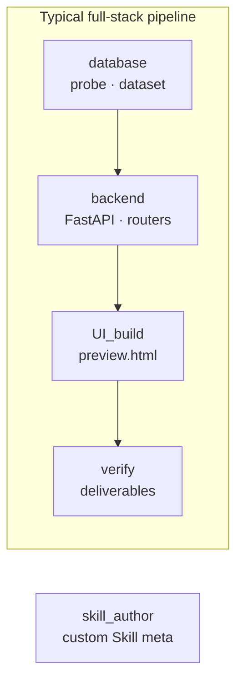
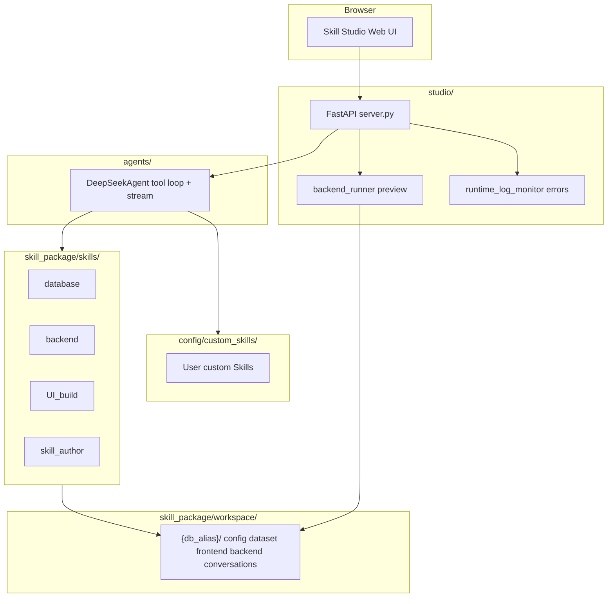

# Skill Studio

A local SaaS builder powered by **DeepSeek** and **Agent Skills**: describe what you want in natural language, and **system Skills** drive the agent to connect databases, write backend APIs, build frontend pages, and preview the full stack in one workspace.

> **Skill Studio is not “just chat”** — it is an orchestratable, on-disk, previewable **system Skill** platform. Each Skill = `SKILL.md` spec + Python tools + artifacts under `workspace/{db_alias}/`.

**UI language**: the web UI defaults to **English**. Use **EN | 中文** in the top-right corner to switch.

---

## Core: What are system Skills?

**System Skills** live under `skill_package/skills/`. They are built-in agent modules with **real execution**:

| Piece | Role |
|-------|------|
| **`SKILL.md`** | Tells the model what to do, in what order, and what to avoid; YAML frontmatter (`name`, `description`, `version`, …) |
| **Python tools** | Registered via `@register_skill_tool`; exposed to DeepSeek as function calling during chat |
| **Workspace writes** | Tool results land in `skill_package/workspace/{db_alias}/` (config, dataset, backend, frontend, …) |

During a conversation, Studio:

1. Loads selected Skills’ `SKILL.md` into the system prompt;
2. Merges registered tool schemas for `DeepSeekAgent` multi-turn tool use;
3. Tools read/write files, connect to DBs, and validate contracts locally — **not “pretend code” from the model**.

In **Skill library → System** you can browse each system Skill’s `SKILL.md`, tools, and tree (**read-only**; do not edit platform code in the UI — fork or add a directory to extend).

### Four built-in system Skills



| Skill | Directory | Purpose | Main output paths | Representative tools |
|-------|-----------|---------|-------------------|----------------------|
| **database** | `skills/database/` | Read-only source DB / files; business knowledge | `dataset/*.md` | `database_connect`, `list_tables`, `describe_table`, `execute_query`, `save_markdown` |
| **backend** | `skills/backend/` | Runnable FastAPI backend | `backend/{project}/` | `scaffold_fullstack_project`, `save_backend_file`, `patch_backend_file`, `get_fullstack_api_contract`, `verify_fullstack_deliverables` |
| **UI_build** | `skills/UI_build/` | DB-connected frontend and UI knowledge | `frontend/{project}/` | `save_ui_file`, `patch_ui_file`, `read_database_config`, `get_fullstack_api_contract` |
| **skill_author** | `skills/skill_author/` | Conversational **custom Skill** creation (no Python toolchain) | `config/custom_skills/` | `create_custom_skill`, `write_custom_skill_file` |

All four Skills share `config.json` and `manifest.json` under `workspace/{db_alias}/`, so dataset docs, APIs, and frontends stay aligned.

### Full-stack generation: how system Skills work together

Recommended order for a runnable frontend + backend (documented in `backend` / `UI_build` `SKILL.md` and `skill_package/core/fullstack_orchestration.py`):

| Step | Skill | Action |
|------|-------|--------|
| 1 | database | Connect source DB / read files → write `dataset/`; create target tables if needed |
| 2 | backend | `get_fullstack_generation_spec` → **`scaffold_fullstack_project`** one-shot skeleton |
| 3 | backend | `save_backend_file` for routers; **no** relative imports or dual-route shims |
| 4 | backend + UI_build | `get_fullstack_api_contract` → align paths via `route_fetch_map` |
| 5 | UI_build | `save_ui_file` for `preview.html` (`FULLSTACK_API` + `apiGet` / `apiPost`) |
| 6 | backend | **`verify_fullstack_deliverables`** → only when `system_complete: true` tell the user the system is done |

**Write gates**: `save_backend_file` / `save_ui_file` return `blocked: true` on contract violations, avoiding “looks done but preview 404” code.

**Database passwords**: the agent uses `database_connect(use_workspace_config=true)` to read `config.json` on disk — **do not** ask the user for passwords in chat (`***` in `read_database_config` is redaction only).

### System Skill vs custom Skill

| | **System Skill** | **Custom Skill** |
|--|------------------|------------------|
| Path | `skill_package/skills/{name}/` | `config/custom_skills/{skill_id}/` |
| Tools | Python tools (DB, files, validation) | Usually `SKILL.md` instructions only |
| Studio | Read-only browse | Upload zip, edit online, delete |
| Enable | When `studio_visible: true`, joins chat | Same |
| Typical use | DB, API, pages | Domain tone, approval rules, industry SOP |

Custom Skills come from **skill_author** or Skill library upload; they can run **alongside** system Skills.

Per-Skill details: [database](skill_package/skills/database/SKILL.md), [backend](skill_package/skills/backend/SKILL.md), [UI_build](skill_package/skills/UI_build/SKILL.md), [skill_author](skill_package/skills/skill_author/SKILL.md).

---

## Feature overview

| Capability | Description |
|------------|-------------|
| **System Skill platform** | `SKILL.md` + tools + workspace writes for full-stack delivery |
| **Multi-SaaS workspaces** | Each `db_alias` has its own config, artifacts, and chat history |
| **Agent chat** | Streaming replies; tools auto-mounted from enabled Skills |
| **Full-stack preview** | Studio starts uvicorn, iframe preview, injects `__STUDIO_API_BASE__` |
| **Runtime error hints** | Preview 4xx/5xx nudges you back to chat to fix |
| **Workspace files / Skill library** | Browse and edit workspace files; browse system and custom Skills |
| **EN / 中文 UI** | Default English; `studio/static/i18n.js` |

---

## Architecture



**Data flow (short)**

1. User picks a **saas** (`db_alias`) and configures MySQL / DeepSeek.
2. Chat hits `stream_chat`: load system Skill `SKILL.md` + tool schemas → `DeepSeekAgent` tool rounds write to disk.
3. **System preview** reads `api_manifest.json`, starts uvicorn, injects `__STUDIO_API_BASE__` into `preview.html`.

---

## Requirements

- Python 3.10+
- MySQL (source DB + recommended separate target DB account)
- Node.js (optional, for some `npm run dev` frontends; Studio full-page preview uses `preview.html`)
- DeepSeek API key ([https://platform.deepseek.com](https://platform.deepseek.com))

---

## Quick start

### 1. Install dependencies

```bash
cd /path/to/skills_self

pip install -r requirements-studio.txt
pip install -r skill_package/requirements-database.txt
# For CLI agent use outside Studio:
pip install -r requirements-agent.txt
```

### 2. Configure the LLM API

**DeepSeek** (default for chat):

```bash
cp config/deepseek.example.json config/deepseek.json
```

Edit `config/deepseek.json` with your `api_key`; adjust `model`, `max_tool_rounds`, `max_tokens`, `timeout_seconds` as needed.

**Google Gemini** (optional): in **New saas / Edit saas**, choose **Google Gemini** as the chat provider and enter an API key (stored in that saas `workspace/{db_alias}/config.json`). You can also copy `config/gemini.example.json` to `config/gemini.json` as a global fallback.

> **Do not** commit `config/deepseek.json` or `config/gemini.json` with real API keys to Git.

### 3. Start Studio

```bash
python run_studio.py
```

Open **http://127.0.0.1:8765** in the browser (use this URL; do not open HTML files directly).

In dev mode, changes under `studio/` and `agents/` hot-reload; refresh after Skill or workspace template changes. Language switch does not require a restart.

### 4. Create a saas and build via system Skills

1. **New saas**: set `db_alias`, MySQL (read-only source + writable target; empty target uses local SQLite `data/app.db`).
2. Open **Chat** and describe your goal, for example:
   - “Connect source DB `basic_data`, document station and employee tables into dataset”
   - “Build a station personnel system from dataset: backend API + frontend preview”
3. The agent calls tools in **database → backend → UI_build** order; output goes to `workspace/{db_alias}/`.
4. **System preview** starts the backend and shows `preview.html`.

In **Skill library → System** you can read each Skill’s rules and tools before chatting.

---

## Workspace layout (system Skill output)

Path: `skill_package/workspace/{db_alias}/` — directories are written by the corresponding system Skill:

```
{db_alias}/
├── config.json           # Connections (source list + target + storage_mode)
├── data/app.db           # SQLite when storage_mode=local (no MySQL target)
├── dataset/              # Domain knowledge Markdown (database skill)
├── backend/              # FastAPI projects (backend skill)
│   └── {project}/
│       ├── main.py
│       ├── api_manifest.json
│       └── .studio_uvicorn.log   # Log when Studio starts the backend
├── frontend/             # Frontend projects (UI_build skill)
│   └── {project}/
│       ├── preview.html    # Studio full-page preview entry (recommended)
│       └── ui_knowledge.md
├── conversations/        # Chat history JSON
└── manifest.json         # Project registry and links
```

Field details: [skill_package/workspace/README.md](skill_package/workspace/README.md).

---

## Extending: custom Skills and new system Skills

### Custom Skill (no Python tools)

- **Upload**: Skill library → Custom → upload a **zip** (must contain `SKILL.md`) → `config/custom_skills/`.
- **Chat create**: Skill library → **Create Skill** → **skill_author** generates files.
- With `studio_visible: true`, joins chat with system Skills; good for **instruction-only** domain rules.

See [skill_author/SKILL.md](skill_package/skills/skill_author/SKILL.md).

### New system Skill (with tools)

1. Add `skill_package/skills/{name}/SKILL.md` (frontmatter: `name`, `description`).
2. Register tools in `scripts/` with `@register_skill_tool("{name}", ...)`.
3. Restart Studio; Skill library and chat pick it up.

Registry: `skill_package/core/registry.py`. Full-stack contract and gates: `fullstack_contract.py`, `fullstack_enforce.py`.

---

## Studio UI

| Entry | Purpose |
|-------|---------|
| **EN \| 中文** | UI language (default English); stored in browser `localStorage` |
| **Chat** | Agent conversation; multi-turn history, stop generation |
| **System preview** | Pick frontend project, auto-start backend, iframe `preview.html` |
| **Open in new tab** | Preview without iframe limits |
| **Restart service** | Restart linked FastAPI (LISTEN process only; Studio stays up) |
| **Backend log** | View `.studio_uvicorn.log` |
| **Back to chat** | Return from preview / files / Skill library; red dot if unhandled runtime errors |
| **Workspace files** | Tree edit `dataset` / `frontend` / `backend` |
| **Skill library** | System / custom Skills; upload zip, edit, delete custom Skills |
| **Create Skill** | Skill creation assistant chat |

### UI i18n

- Strings: `studio/static/i18n.js` (`en` / `zh`, global `t(key)`).
- Static HTML: `data-i18n`, `data-i18n-html`, `data-i18n-placeholder`, etc.
- Dynamic UI in `studio/static/app.js` via `t()`; switching language refreshes the current view.
- **Agent messages** (user + AI) are not translated with UI language.

### System preview and API integration

- Studio reads `api_manifest.json` `default_port`, `api_prefix`, probes routes, injects `window.__STUDIO_API_BASE__` (`apiGet` / `apiPost` in the `FULLSTACK_API` block).
- Frontend paths must match `main.py` and `get_fullstack_api_contract`; `api_prefix` is only `"/api"` or `""`, not prose.
- New 4xx/5xx in logs during preview: **Back to chat** or **Ignore**; the same error is not repeated.

---

## Project structure

```
skills_self/
├── run_studio.py              # Start Web Studio
├── requirements-studio.txt
├── config/
│   ├── deepseek.json          # API config (local; do not commit secrets)
│   ├── deepseek.example.json
│   ├── studio_state.json      # Selected saas, etc.
│   └── custom_skills/         # User custom Skills (zip / chat)
│       └── {skill_id}/
│           └── SKILL.md
├── agents/
│   └── deepseek_backend.py    # DeepSeek tool loop + streaming
├── studio/
│   ├── server.py              # FastAPI routes
│   ├── services.py            # Orchestration, chat, config
│   ├── backend_runner.py      # Preview backend start / probe
│   ├── runtime_log_monitor.py # Log error parsing
│   ├── system_preview.py
│   ├── artifacts.py           # Workspace file tree
│   └── static/                # Web UI
│       ├── index.html
│       ├── i18n.js            # EN / 中文 strings
│       ├── app.js
│       └── app.css
└── skill_package/
    ├── skills/                # System Skills: database / backend / UI_build / skill_author
    ├── core/                  # Registry, full-stack contract / gates / scaffold, orchestration
    └── workspace/             # Per-saas artifacts (user data)
```

---

## Configuration reference

### `config/deepseek.json`

| Field | Description | Default |
|-------|-------------|---------|
| `api_key` | DeepSeek API key | Required |
| `base_url` | API base URL | `https://api.deepseek.com` |
| `model` | Model name | `deepseek-chat` |
| `max_tool_rounds` | Max tool loops per user turn | `50` |
| `max_tokens` | Max tokens per generation | `8192` |
| `timeout_seconds` | HTTP timeout (seconds) | `300` |

### Per-saas LLM (`workspace/{db_alias}/config.json`)

| Field | Description |
|-------|-------------|
| `llm_provider` | `deepseek` (default) or `gemini` |
| `gemini_api_key` | Gemini key when provider is `gemini` |
| `gemini_model` | e.g. `gemini-2.0-flash` |

### `backend/.../api_manifest.json` (excerpt)

| Field | Description |
|-------|-------------|
| `linked_frontend` | Linked frontend project name |
| `default_port` | uvicorn port |
| `api_prefix` | Must match `main.py` mount |

---

## Development and testing

See **[Extending: custom Skills and new system Skills](#extending-custom-skills-and-new-system-skills)** above.

```bash
python database_test.py          # database Skill
python ui_build_test.py          # UI_build Skill
python skill_invoke_example.py   # Tool invocation example
```

**Boundaries**: platform code in `skill_package/skills/`, `skill_package/core/`, `studio/`; user saas output in `workspace/{db_alias}/` (not bulk-rewritten by default).

---

## FAQ

**Q: UI is in English — how do I switch to Chinese?**  
Click **中文** in the top-right; your choice is remembered. Default is English.

**Q: First backend start for a new saas fails?**  
Common causes: ① **First** run runs `pip install -r requirements.txt` — wait 1–2 minutes, then **Restart service**; ② `main.py` uses **relative imports** like `from .routers` (Studio runs `uvicorn main:app` — use `from routers import ...`); ③ syntax / NameError in `main.py`. Check **Backend log** or ask the agent to fix in chat.

**Q: “Restart service” killed all of Studio?**  
Update to latest code and hard-refresh. Older builds could kill clients on port 8000; now only **LISTEN** processes are terminated.

**Q: `run_studio.py` says python-multipart is missing?**  
Run `pip install python-multipart` or `pip install -r requirements-studio.txt` again.

**Q: Preview has data but it does not match MySQL?**  
Check `config.json` `host` / `user` and whether backend `database.py` points at a local SQLite demo DB. The agent should use `database_connect(use_workspace_config=true)` — **no password in chat**. If `host`/`user` are empty, fill them on the **Edit saas** page.

**Q: Blank preview or API 404?**  
Ensure `preview.html` `API_BASE` matches the real backend; **Restart service** in system preview and check **Backend log** for 404/500.

**Q: Agent asks for my database password in chat?**  
It should not. Passwords live in `workspace/{db_alias}/config.json`; `read_database_config` shows `***` for redaction. Use `database_connect(use_workspace_config=true)`.

**Q: Agent reply stops mid-way?**  
Tool rounds or network timeout; say “please continue”. Increase `timeout_seconds` / `max_tokens` in `deepseek.json`.

**Q: Agent talks too much?**  
Platform prompts favor conclusions and silent tool runs; start a **new chat** and restart Studio after config changes.

**Q: Error toast returns after I dismissed it and re-open preview?**  
Preview establishes a baseline; only **new** errors are shown. Use **Ignore** for one-off cases. Hard-refresh static assets (`index.html` `?v=` version) and restart Studio.

**Q: Custom Skill upload but nothing in the list?**  
Upload a **zip** (not a folder) containing `SKILL.md`. Check Skill library **Custom**. If `skill_id` collides with a system Skill name, it appears only under Custom.

**Q: System Skill vs custom Skill?**  
System Skills (`skill_package/skills/`) have **Python tools** (DB, files, full-stack checks); Studio browse is **read-only**. Custom Skills (`config/custom_skills/`) are usually `SKILL.md` only; upload zip or use **skill_author**. Both can be enabled with `studio_visible: true`.

**Q: Agent ignores Skill rules?**  
Full-stack has **write gates** (`blocked: true`) and `verify_fullstack_deliverables`. Ask for `get_fullstack_generation_spec` then `scaffold_fullstack_project`, or read **Skill library → backend** and restate requirements.

**Q: Custom and system Skills together?**  
Yes. Any Skill with `studio_visible: true` in `SKILL.md` is enabled in chat.

---

## License

This repository is licensed under the **PolyForm Noncommercial License 1.0.0**. See [LICENSE.txt](LICENSE.txt).

Copyright (c) winnow 2026/05

---

## Related docs

- [Workspace layout](skill_package/workspace/README.md)
- **System Skill specs (recommended)**
  - [database/SKILL.md](skill_package/skills/database/SKILL.md) — source/target DB, dataset
  - [backend/SKILL.md](skill_package/skills/backend/SKILL.md) — FastAPI, scaffold, gates
  - [UI_build/SKILL.md](skill_package/skills/UI_build/SKILL.md) — frontend, FULLSTACK_API contract
  - [skill_author/SKILL.md](skill_package/skills/skill_author/SKILL.md) — custom Skills
- Platform core: `skill_package/core/fullstack_contract.py`, `fullstack_enforce.py`, `fullstack_orchestration.py`
