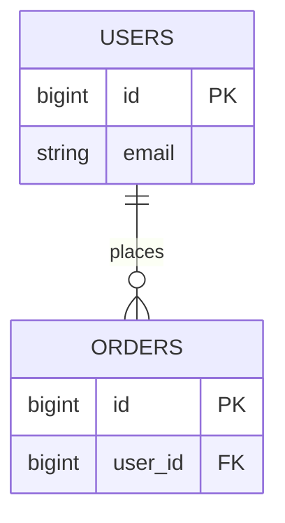

# {Topic title}

## 1. Business context and goals

- **Business scenario**:
- **Questions to answer this pass**:
- **Out of scope**:

## 2. Core entities and table mapping

| Business entity | Primary table | Notes |
|-----------------|---------------|-------|
| e.g. User | users | Account master data |

## 3. Table structure summary

### 3.1 `{table_name}`

| Column | Type | Nullable | Key | Business meaning |
|--------|------|----------|-----|------------------|
| id | bigint | N | PK | Primary key |

**Sample observations** (redacted): …

## 4. Data relationships

### 4.1 Relationship overview

| From table | From column | To table | To column | Cardinality | Evidence |
|------------|-------------|----------|-----------|-------------|----------|
| orders | user_id | users | id | N:1 | naming + samples |

### 4.2 ER diagram (Mermaid)

## 5. Key business rules (inferred from schema)

- …

## 6. Open questions / risks

- Implied relations without FK: …
- Enum/status meanings not documented in DB: …

## 7. Appendix

- **Connection info**: `db_alias` / `db_type` / `database` (no passwords)
- **Tables analyzed**:
- **Tables not covered**:
