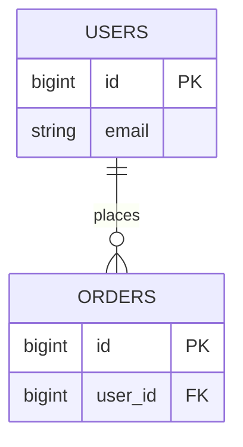

# {主题标题}

## 1. 业务背景与目标

- **业务场景**：
- **本次要搞清楚的问题**：
- **不在本次范围**：

## 2. 核心实体与表映射

| 业务实体 | 主表 | 说明 |
|----------|------|------|
| 例：用户 | users | 账号主数据 |

## 3. 表结构摘要

### 3.1 `{table_name}`

| 字段 | 类型 | 可空 | 键 | 业务含义 |
|------|------|------|-----|----------|
| id | bigint | N | PK | 主键 |

**样本观察**（脱敏）：…

## 4. 数据关系

### 4.1 关系一览

| 从表 | 从字段 | 到表 | 到字段 | 关系类型 | 依据 |
|------|--------|------|--------|----------|------|
| orders | user_id | users | id | N:1 | 字段命名 + 样本 |

### 4.2 ER 示意（Mermaid）

## 5. 关键业务规则（从库结构推断）

- …

## 6. 待确认 / 风险

- 无外键但命名暗示关联的表：…
- 枚举/状态字段含义未在库内注释：…

## 7. 附录

- **连接信息**：`db_alias` / `db_type` / `database`（不含密码）
- **分析过的表**：
- **未覆盖的表**：
