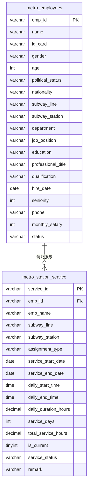

# 地铁人力调配系统 — 数据库知识库

## 1. 业务背景与目标

- **业务场景**：地铁公司对人力的精细化调配管理，包括员工基本信息管理、站点服务派遣、轮岗/临时支援/常驻等调配模式。
- **本次要搞清楚的问题**：
  - 员工有哪些基础属性（部门、岗位、资质、薪资等）？
  - 员工如何被分配到各线路/站点服务？有哪些分配类型？
  - 历史服务记录 vs 当前在岗情况如何标识？
- **不在本次范围**：考勤、薪酬计算流水、招聘流程。

## 2. 核心实体与表映射

| 业务实体 | 主表 | 说明 |
|----------|------|------|
| 员工 | metro_employees | 地铁员工主数据，含个人信息、岗位、资质等 |
| 站点服务记录 | metro_station_service | 员工在各线路/站点的服务调配记录（含历史） |

## 3. 表结构摘要

### 3.1 `metro_employees` — 员工主表（1000条）

| 字段 | 类型 | 可空 | 键 | 业务含义 |
|------|------|------|-----|----------|
| emp_id | varchar(8) | N | PK | 员工编号（主键） |
| name | varchar(32) | N | | 姓名 |
| id_card | varchar(18) | N | | 身份证号 |
| gender | varchar(4) | N | | 性别 |
| age | int | N | | 年龄 |
| political_status | varchar(32) | N | | 政治面貌：群众/中共党员/共青团员/民主党派 |
| nationality | varchar(32) | N | | 民族 |
| subway_line | varchar(16) | N | | 所属线路：1号线~5号线 |
| subway_station | varchar(64) | N | | 所属站点 |
| department | varchar(64) | N | | 部门（共10个） |
| job_position | varchar(64) | N | | 岗位（共41种） |
| education | varchar(16) | N | | 学历：高中/中专/大专/本科/硕士 |
| professional_title | varchar(32) | N | | 职称：无职称/初级职称/中级职称/高级职称 |
| qualification | varchar(64) | N | | 资质证书 |
| hire_date | date | N | | 入职日期 |
| seniority | int | N | | 工龄（年） |
| phone | varchar(16) | N | | 联系电话 |
| monthly_salary | int | N | | 月薪（元） |
| status | varchar(16) | N | | 在职状态：在职(680)/出差(153)/休假(167) |

### 3.2 `metro_station_service` — 站点服务记录表（2035条）

| 字段 | 类型 | 可空 | 键 | 业务含义 |
|------|------|------|-----|----------|
| service_id | varchar(16) | N | PK | 服务记录编号 |
| emp_id | varchar(8) | N | FK→metro_employees | 员工编号（外键） |
| emp_name | varchar(32) | N | | 员工姓名（冗余） |
| subway_line | varchar(16) | N | MUL | 服务线路 |
| subway_station | varchar(64) | N | | 服务站点 |
| assignment_type | varchar(16) | N | | 调配类型：常驻/轮岗/临时支援 |
| service_start_date | date | N | | 该服务开始日期 |
| service_end_date | date | Y | | 该服务结束日期（null=仍在岗） |
| daily_start_time | time | N | | 每日上班时间 |
| daily_end_time | time | N | | 每日下班时间 |
| daily_duration_hours | decimal(4,1) | N | | 每日工时（小时） |
| service_days | int | N | | 该服务周期总天数 |
| total_service_hours | decimal(10,1) | N | | 该服务周期总工时 |
| is_current | tinyint(1) | N | MUL | 是否为当前在岗记录：1=是，0=否 |
| service_status | varchar(16) | N | | 服务状态：服务中/已结束 |
| remark | varchar(128) | Y | | 备注 |

## 4. 数据关系

### 4.1 关系一览

| 从表 | 从字段 | 到表 | 到字段 | 关系类型 | 依据 |
|------|--------|------|--------|----------|------|
| metro_station_service | emp_id | metro_employees | emp_id | N:1 | 字段命名一致 + 索引(MUL)表明外键关系 |

### 4.2 ER 示意（Mermaid）

## 5. 关键业务规则（从库结构推断）

1. **员工与线路/站点**：每个员工在 `metro_employees` 中有一条"所属关系"记录（所属线路+所属站点），但实际服务调配记录在 `metro_station_service` 中。
2. **调配类型**（assignment_type）：常驻（长期固定）、轮岗（周期性轮换）、临时支援（短期支援）。
3. **当前在岗标识**：`is_current=1` 且 `service_status='服务中'` 表示员工当前正在该站点服务；一个员工同一时间段仅一条 `is_current=1` 记录。
4. **历史追溯**：`metro_station_service` 保留所有历史调配记录（包括轮岗、临时支援已结束的），`service_end_date` 为 NULL 表示仍在岗。
5. **员工状态**：在职(68%)、出差(15%)、休假(17%)，可能与 `metro_station_service` 的当前在岗状态联动。
6. **线路分布**：1号线166人、2号线249人、3号线192人、4号线187人、5号线206人，2号线人数最多。
7. **部门体系**：10个部门，含站务部、调度指挥中心、维修工程部、运营管理部、技术部、安全监察部、人力资源部、行政部、财务部、客服中心。
8. **岗位体系**：41种岗位，覆盖运营（站长/副站长/站务员/票务员/安检员）、调度（调度长/调度员/监控员）、维修（维修工程师/维修技师/电工/信号工/机械师）、管理（运营经理/行政经理/财务经理/HR经理/技术经理/安全总监）等。

## 6. 待确认 / 风险

- `metro_station_service` 的 `emp_id` 虽命名暗示外键且建有索引(MUL)，但需确认是否在数据库层面有正式外键约束。
- `metro_employees` 中无正式外键定义，线路和站点名称以字符串存储，建议后续枚举标准化。
- `assignment_type`（常驻/轮岗/临时支援）的取值是否有业务字典表？当前为硬编码字符串。
- `service_status` 与 `is_current` 两个字段语义部分重叠，需确认业务中是否一致（目前样本中 service_status='服务中' ↔ is_current=1 匹配）。
- `metro_employees` 的 `subway_station`（所属站点）与 `metro_station_service` 的 `subway_station`（服务站点）的关系：前者是编制所属，后者是实际服务站点，可能存在不一致。

## 7. 附录

- **连接信息**：`db_alias=hr_project` / `db_type=mysql` / `database=basic_data`（源库，只读）
- **分析过的表**：`metro_employees`(1000条)、`metro_station_service`(2035条)
- **未覆盖的表**：无（源库仅此两表）
