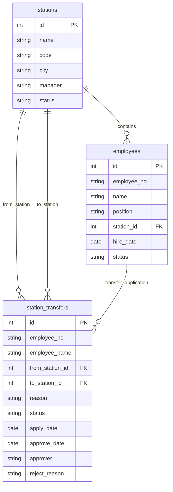

# 站点人员信息系统 — 业务域

## 1. 业务背景与目标

- 管理各站点的员工信息，支持按站点查看人员分布、职位统计
- 员工可提交换站点申请，管理员进行审批/驳回
- 系统需展示员工基本信息、人员统计分析、换站申请流转

## 2. 核心实体与表映射

| 业务实体 | 主表 | 说明 |
|----------|------|------|
| 站点 | stations | 各城市运营站点基本信息 |
| 员工 | employees | 各站点员工基本信息 |
| 换站申请 | station_transfers | 员工主动发起的换站点申请 |

## 3. 表结构摘要

### 3.1 `stations`（站点表）

| 字段 | 类型 | 可空 | 键 | 业务含义 |
|------|------|------|-----|----------|
| id | INTEGER | N | PK | 主键 |
| name | TEXT | N | | 站点名称，如"北京站" |
| code | TEXT | N | | 站点编码，如"BJZ" |
| address | TEXT | Y | | 站点地址 |
| city | TEXT | N | | 所在城市 |
| manager | TEXT | Y | | 站点负责人 |
| status | TEXT | N | | 状态：active/inactive |
| created_at | TIMESTAMP | Y | | 创建时间 |

### 3.2 `employees`（员工表）

| 字段 | 类型 | 可空 | 键 | 业务含义 |
|------|------|------|-----|----------|
| id | INTEGER | N | PK | 主键 |
| employee_no | TEXT | N | | 员工编号，唯一 |
| name | TEXT | N | | 员工姓名 |
| gender | TEXT | Y | | 性别 |
| phone | TEXT | Y | | 手机号 |
| email | TEXT | Y | | 电子邮箱 |
| position | TEXT | N | | 职位（站点经理/运营主管/配送员/客服专员等） |
| station_id | INTEGER | N | FK→stations.id | 所属站点 |
| hire_date | DATE | N | | 入职日期 |
| status | TEXT | N | | 状态：active/inactive |
| created_at | TIMESTAMP | Y | | 创建时间 |

### 3.3 `station_transfers`（换站申请表）

| 字段 | 类型 | 可空 | 键 | 业务含义 |
|------|------|------|-----|----------|
| id | INTEGER | N | PK | 主键 |
| employee_no | TEXT | N | | 员工编号 |
| employee_name | TEXT | N | | 员工姓名 |
| from_station_id | INTEGER | N | FK→stations.id | 原站点 |
| to_station_id | INTEGER | N | FK→stations.id | 目标站点 |
| reason | TEXT | Y | | 申请理由 |
| status | TEXT | N | | 申请状态：pending/approved/rejected |
| apply_date | DATE | N | | 申请日期 |
| approve_date | DATE | Y | | 审批日期 |
| approver | TEXT | Y | | 审批人 |
| reject_reason | TEXT | Y | | 驳回理由 |
| created_at | TIMESTAMP | Y | | 创建时间 |

## 4. 数据关系

### 4.1 关系一览

| 从表 | 从字段 | 到表 | 到字段 | 关系类型 |
|------|--------|------|--------|----------|
| employees | station_id | stations | id | N:1 |
| station_transfers | from_station_id | stations | id | N:1 |
| station_transfers | to_station_id | stations | id | N:1 |
| station_transfers | employee_no | employees | employee_no | N:1 |

### 4.2 ER 示意

## 5. 关键业务规则

- 员工状态 `active` 才能申请换站
- 换站申请状态流转：pending → approved / rejected
- 审批不通过时填写 `reject_reason`
- 审批通过后，员工 `station_id` 应更新为目标站点

## 6. 待确认

- 当前数据无外键约束，但业务有隐含关联关系

## 7. 附录

- **连接信息**：test2 / sqlite / data/app.db
- **分析过的表**：stations, employees, station_transfers
- **未覆盖的表**：无
