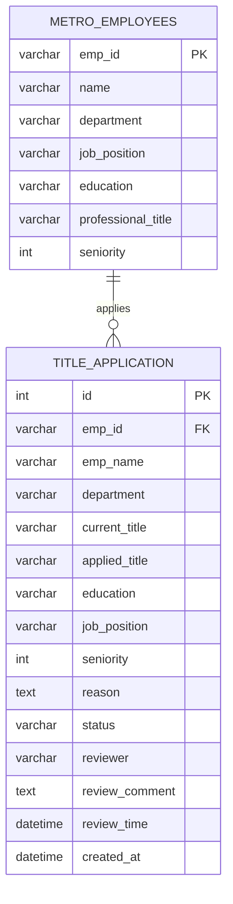

# 员工职称管理系统 - 业务知识文档

## 1. 业务背景与目标

- **业务场景**：地铁集团员工可通过系统申请职称晋升（初级→中级→高级），HR/部门负责人审批，并可视化展示全集团职称分布。
- **本次要搞清楚的问题**：
  - 员工基础数据（部门、岗位、学历、当前职称等）
  - 职称等级体系（无职称、初级职称、中级职称、高级职称）
  - 审批流程设计
- **不在本次范围**：薪资联动、职称考试管理。

## 2. 核心实体与表映射

| 业务实体 | 主表 | 说明 |
|----------|------|------|
| 员工 | basic_data.metro_employees | 员工主数据（1000人） |
| 职称申请 | allocation.title_application | 职称申请与审批记录 |

## 3. 表结构摘要

### 3.1 `basic_data.metro_employees`（源库，只读）

| 字段 | 类型 | 可空 | 键 | 业务含义 |
|------|------|------|-----|----------|
| emp_id | varchar(8) | N | PK | 员工编号 |
| name | varchar(32) | N | | 姓名 |
| id_card | varchar(18) | N | | 身份证号 |
| gender | varchar(4) | N | | 性别 |
| age | int | N | | 年龄 |
| political_status | varchar(32) | N | | 政治面貌 |
| nationality | varchar(32) | N | | 民族 |
| subway_line | varchar(16) | N | | 所属线路 |
| subway_station | varchar(64) | N | | 所属站点 |
| department | varchar(64) | N | | 所属部门 |
| job_position | varchar(64) | N | | 岗位名称 |
| education | varchar(16) | N | | 学历（中专/高中/大专/本科/硕士/博士） |
| professional_title | varchar(32) | N | | 职称（无职称/初级职称/中级职称/高级职称） |
| qualification | varchar(64) | N | | 资质证书 |
| hire_date | date | N | | 入职日期 |
| seniority | int | N | | 工龄（年） |
| phone | varchar(16) | N | | 电话 |
| monthly_salary | int | N | | 月薪 |
| status | varchar(16) | N | | 在职状态 |

### 3.2 `allocation.title_application`（目标库，可写）

| 字段 | 类型 | 可空 | 键 | 业务含义 |
|------|------|------|-----|----------|
| id | int | N | PK | 申请ID |
| emp_id | varchar(8) | N | | 员工编号 |
| emp_name | varchar(32) | N | | 员工姓名 |
| department | varchar(64) | N | | 所属部门 |
| current_title | varchar(32) | N | | 当前职称 |
| applied_title | varchar(32) | N | | 申请职称 |
| education | varchar(16) | N | | 学历 |
| job_position | varchar(64) | N | | 岗位 |
| seniority | int | N | | 工龄 |
| reason | text | Y | | 申请理由 |
| status | varchar(16) | N | | 待审批/已通过/已驳回 |
| reviewer | varchar(64) | Y | | 审批人 |
| review_comment | text | Y | | 审批意见 |
| review_time | datetime | Y | | 审批时间 |
| created_at | datetime | N | | 申请时间 |
| updated_at | datetime | N | | 更新时间 |

## 4. 数据关系

### 4.1 关系一览

| 从表 | 从字段 | 到表 | 到字段 | 关系类型 | 依据 |
|------|--------|------|--------|----------|------|
| title_application | emp_id | metro_employees | emp_id | N:1 | 员工编号关联 |

### 4.2 ER 示意

## 5. 关键业务规则

- **职称晋升阶梯**：无职称 → 初级职称 → 中级职称 → 高级职称（逐级晋升）
- **申请约束**：申请职称等级必须高于当前职称
- **审批流程**：管理员审批，通过后更新员工职称；驳回则保留原职称
- **已有数据**：metro_employees 中约 1000 名员工，分布在 10 个部门

## 6. 待确认 / 风险

- 审批人角色暂未单独建表（采用简单 reviewer 字段）
- 职称申请的学历/工龄门槛未做硬性校验，可在前端提示

## 7. 附录

- **连接信息**：db_alias=zhicheng / mysql
- **分析过的表**：metro_employees, metro_station_service
- **未覆盖的表**：无
